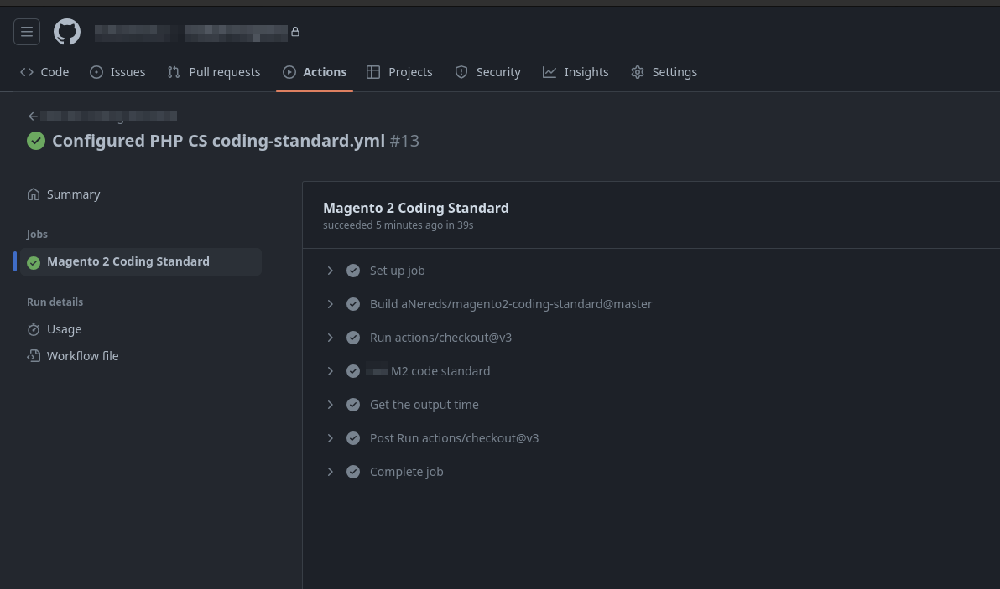

# Magento2 Code Sniffer Github Action
​
This repository's aim is to provide open sourced GitHub action to develop better Magento 2 extensions.
​
- [Main Functionalities](#Main-functionalities) 
- [Installation](#Installation) 
- [Configuration](#Configuration) 
  ​
  ​
## Main Functionalities
### Executes on Repository events Like Pull-request or Merge e.t.c
​


## Installation
### In your GitHub repository add the below as `<root>.github/workflows/coding-standard.yml`
```yaml
name: M2 Coding Standard
on:
  push:
  pull_request:
    branches:
      - "*"
jobs:
  static:
    name: Magento 2 Coding Standard
    runs-on: ubuntu-latest
    steps:
      - uses: actions/checkout@v3
      - name: M2 code standard
        id: magento
        uses: aNereds/magento2-coding-standard@master
        with:
          fileExtensions: "php,phtml,xml"
          onlyErrors: "no"
          sourceReport: "yes"
      - name: Get the output time
        run: echo "Action Output, ${{ steps.magento.outputs.time }}"
```
## Configuration

### Setting up file Extensions to include in report
`By default, PHP_CodeSniffer will check any file it finds with a .inc, .php, .js or .css extension, although not all standards will actually check all these file types.
Sometimes, this means that PHP_CodeSniffer is not checking enough of your files. Sometimes, the opposite is true.
To specify file extensions can be added separated by coma to override default values `
```yaml
....
        with:
          fileExtensions: "php,phtml,xml" - ### Here can be specified file extensions for validation
          onlyErrors: "yes"
          sourceReport: "yes"
....
```
### Disabling Warning in Report
`If you don't want warnings included in the output, specify the -n command line argument.
By following coding-standard.yml file adjustments.`
```yaml
....
        with:
          fileExtensions: "php,phtml,xml"
          onlyErrors: "yes" - ### This flag should be set to yes
          sourceReport: "yes"
....
```
### Enabling Source Report
`By default, PHP_CodeSniffer will print a complete list of all errors and warnings it finds.
This list can become quite long, especially when checking a large number of files at once.
To print a summary report that only shows the number of errors and warnings for each file,
use the sourceReport: "yes" set to yes.`
```yaml
....
        with:
          fileExtensions: "php,phtml,xml"
          onlyErrors: "no" 
          sourceReport: "yes" - ### This flag should be set to yes
....
```